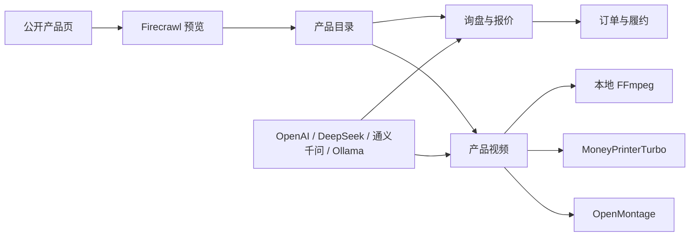

<p align="center">
  
</p>

<h1 align="center">TradePilot</h1>

<p align="center">
  <strong>开源 AI 外贸 CRM、订单履约与产品视频工作台</strong>
</p>

<p align="center">
  客户 · 询盘 · 报价 · 订单 · 出货 · AI 模型 · 产品视频
</p>

<p align="center">
  <a href="https://tradepilot.us.kg/"><strong>在线演示</strong></a>
  ·
  <a href="#快速部署"><strong>快速部署</strong></a>
  ·
  <a href="#产品视频工作流"><strong>视频工作流</strong></a>
  ·
  <a href="https://github.com/feifei9126/tradepilot/issues"><strong>反馈问题</strong></a>
</p>

<p align="center">
  
  
  
  
  
</p>

---

## 先看效果

[](https://tradepilot.us.kg/)

| 在线演示 | 信息                                                   |
| -------- | ------------------------------------------------------ |
| 地址     | [https://tradepilot.us.kg/](https://tradepilot.us.kg/) |
| 测试账号 | `demo@tradepilot.dev`                                  |
| 测试密码 | `12345678`                                             |

TradePilot 面向 1-5 人外贸团队，把分散的客户资料、报价、订单、出货、AI 配置和产品内容生产放进同一个可自托管工作区。它不是只有一张 KPI 看板的演示项目，仓库同时包含业务 API、输入校验、测试、Docker 部署、视频 Worker 和第三方服务接入说明。

生产环境必须配置 PostgreSQL（Neon 或其他兼容 PostgreSQL 的服务），不会降级到内存数据。本地 `npm run dev` 在没有 `DATABASE_URL` 时使用隔离的内存演示模式；配置 `DATABASE_URL` 后，本地开发也会直接使用 PostgreSQL。

## 为什么是 TradePilot

| 你需要解决的问题           | TradePilot 的处理方式                                             |
| -------------------------- | ----------------------------------------------------------------- |
| 客户、询盘、报价和订单分散 | 用一条业务链关联客户、报价、订单、出货和单证草稿                  |
| AI 平台被单一供应商锁定    | BYOK，自行配置 OpenAI、DeepSeek、通义千问、Ollama 或兼容 API      |
| 产品网页和素材整理耗时     | Firecrawl 抓取产品资料、图片和视频，确认后再导入                  |
| 产品视频制作链路割裂       | 本地 FFmpeg、MoneyPrinterTurbo、OpenMontage 三种生产路径统一管理  |
| SaaS 数据与二次开发受限    | AGPL-3.0 开源，支持 Docker 自托管和源码级扩展                     |
| 设置项容易配置失败         | 提供 Base URL、请求路径、模型映射、User-Agent、Headers 和代理覆盖 |

## 核心能力

### 外贸 CRM 与订单履约

- 客户档案、联系人、标签、来源与跟进状态
- 询盘创建、状态流转和 AI 回复草稿
- 报价草稿、贸易术语、成本加价与人工接受确认
- 报价转订单、订单进度、沟通记录和交期风险
- 出货、物流、供应商、财务汇总与单证草稿
- 基于真实业务记录生成的仪表盘、销售漏斗和待办提醒

### 多租户、邮件与订单收款

- 工作区切换、成员邀请和基于角色的业务权限
- 在 `/app/email/settings` 配置 SMTP/IMAP 或 Resend 邮箱，凭据加密后存入 PostgreSQL
- Docker 的 `mail-worker` 负责 SMTP 发件和 IMAP 增量收件；Cloudflare 通过 Resend webhook 与每 5 分钟 Cron 处理收发
- 在 `/app/settings/payments` 配置 Stripe、支付宝或微信支付商户，生成订单收款链接并处理回调和退款
- 支付模块只用于订单收款与退款，不包含 SaaS 订阅计费

### AI 模型与 Ollama

- 支持 OpenAI、DeepSeek、通义千问与 OpenAI 兼容服务
- 支持 Ollama 本地模型检测、推荐模型和安装命令
- 可配置完整 API 请求地址、模型映射和自定义请求头
- 支持自定义 User-Agent、本地代理与请求地址覆盖
- API Key 保存在当前浏览器，通过 TradePilot 服务端发起请求

### Firecrawl 产品采集

- 从公开产品页提取名称、描述、规格、图片和视频
- 导入前预览与人工确认，不直接污染产品数据
- 抓取到的视频可进入 MoneyPrinterTurbo 重新编排
- 本地环境提供 Docker 检测、部署进度、日志和连接验证

### 产品视频工作流

| 模式        | 适合场景           | 运行方式                                       |
| ----------- | ------------------ | ---------------------------------------------- |
| 本地快速    | 内部确认、快速样片 | FFmpeg Worker 生成可播放 MP4                   |
| AI 自动成片 | 社媒推广、客户介绍 | MoneyPrinterTurbo 处理配音、字幕、音乐和多素材 |
| 高级制作    | 品牌项目、复杂镜头 | OpenMontage 命令适配器接入自定义流水线         |

产品视频页包含引擎健康状态、素材输入、任务队列、进度、预览、下载、批量选择和删除。任务数据可写入持久卷，服务重启后仍可查询。

## 快速部署

### Docker 一键部署

前置条件：Docker Desktop，或已启用 Compose 插件的 Docker Engine。

```bash
git clone https://github.com/feifei9126/tradepilot.git
cd tradepilot
bash install.sh
```

安装器会：

1. 生成认证密钥、凭据加密密钥、PostgreSQL 密码和随机管理员密码，并保存到本机 `.env`。
2. 构建并启动 PostgreSQL，执行迁移和管理员初始化。
3. 启动 TradePilot、本地视频 Worker，以及负责 SMTP/IMAP 的 `mail-worker`。
4. 在后台启动 MoneyPrinterTurbo 和 Redis，并输出登录账号、密码和服务状态命令。

生产数据库默认是空的。只有显式设置 `TRADEPILOT_SEED_DEMO=true`，初始化时才会写入演示客户、产品、询盘、报价、订单和物流记录。

完成后访问 [http://localhost:3456](http://localhost:3456)。

常用命令：

```bash
docker compose ps
docker compose logs -f
docker compose restart
docker compose down
```

### 本地开发

```bash
git clone https://github.com/feifei9126/tradepilot.git
cd tradepilot
npm install
npm run dev
```

开发地址为 [http://localhost:3458](http://localhost:3458)。`npm run dev` 未配置 `DATABASE_URL` 时使用内存演示账号 `demo@tradepilot.dev` / `12345678`；这组账号不会进入生产数据库。该模式只提供演示数据和邮件草稿，不会执行真实邮件收发或订单支付。

生产运行：

```bash
npm run build
npm start
```

`npm start` 会同时管理 Next.js 和本地视频 Worker；无需再开第二个终端。只启动网页可设置 `TRADEPILOT_START_VIDEO_WORKER=false`。

### Cloudflare Workers

Cloudflare Workers 生产环境必须使用 PostgreSQL/Neon。推荐使用引导命令，它会在本地执行连接检查、迁移、管理员 bootstrap、secret 设置、构建、部署和健康检查：

```bash
npm install
npm run setup:cloudflare
```

也可以先预览命令而不触碰数据库或 Worker：

```bash
npm run setup:cloudflare -- --dry-run
```

引导命令会上传 `DATABASE_URL`、`AUTH_SECRET`、`TRADEPILOT_CREDENTIALS_KEY` 和 `TRADEPILOT_CRON_SECRET`，并把后三个可复用密钥保存在被 Git 忽略的 `.env.cloudflare`。该文件必须私密备份；删除或轮换 `TRADEPILOT_CREDENTIALS_KEY` 会导致数据库中已有邮箱和支付凭据无法解密。不要把这些值写入 `wrangler.jsonc`。

`TRADEPILOT_ADMIN_EMAIL` 与 `TRADEPILOT_ADMIN_PASSWORD` 只用于本地 bootstrap；初始化完成后密码不会上传到 Worker，可从本地环境中删除。生产默认不导入演示业务数据；需要时在引导命令前设置 `TRADEPILOT_SEED_DEMO=true`。

部署完成后，在 `/app/email/settings` 添加 Resend 账户，并把 Resend 入站 webhook 设置为 `https://<domain>/api/webhooks/email/resend`。Cloudflare Cron 每 5 分钟处理一次 Resend 发件队列。订单收款账户在 `/app/settings/payments` 配置；服务商 webhook 使用页面显示的公开账户 ID，地址形状为 `https://<domain>/api/webhooks/payments/<provider>/<publicAccountId>`。

Cloudflare Git 自动构建只负责构建和部署，不会替你运行数据库迁移。升级版本时，先在可访问数据库的环境运行 `npm run db:migrate`（或再次运行引导命令），再触发 Git 构建。

Cloudflare Workers 不运行 Docker、FFmpeg 或本地文件系统任务。使用 Cloudflare 部署时，需要把 Firecrawl、MoneyPrinterTurbo 和 OpenMontage Worker 部署为独立服务，再通过环境变量连接。完整产品视频能力优先推荐 Docker 部署。

## 工作流



## 配置

复制环境变量模板：

```bash
cp .env.example .env
```

关键配置：

| 变量                        | 用途                                        |
| --------------------------- | ------------------------------------------- |
| `AUTH_SECRET`               | NextAuth 会话签名密钥，生产环境必须随机生成 |
| `TRADEPILOT_ADMIN_EMAIL`    | 部署管理员邮箱                              |
| `TRADEPILOT_ADMIN_PASSWORD` | 首次 bootstrap 使用的管理员密码             |
| `DATABASE_URL`              | 生产必填；Neon 或其他兼容 PostgreSQL 的连接串 |
| `TRADEPILOT_SEED_DEMO`      | 显式设为 `true` 才导入演示业务数据           |
| `TRADEPILOT_CREDENTIALS_KEY` | 邮箱和支付凭据的 32 字节加密密钥             |
| `TRADEPILOT_CRON_SECRET`    | Cloudflare 邮件队列 Cron 的内部鉴权密钥       |
| `TRADEPILOT_DATA_DIR`       | 产品视频任务持久化目录                      |
| `OPENMONTAGE_WORKER_URL`    | OpenMontage / 本地 FFmpeg Worker 地址       |
| `MONEYPRINTERTURBO_URL`     | MoneyPrinterTurbo API 地址                  |
| `FIRECRAWL_API_URL`         | Firecrawl Cloud 或自托管 API 地址           |
| `FIRECRAWL_API_KEY`         | Firecrawl API Key                           |

## 数据与功能边界

开源项目的可信度来自边界清楚，而不是功能列表越长越好：

- 客户、产品、询盘、报价、订单、物流和单据在生产环境通过租户隔离的 PostgreSQL 仓库持久化。
- 只有本地无数据库开发模式使用内存演示数据；生产默认空库，演示 seed 必须显式开启。
- 客户批量导入在数据库事务中整批提交或回滚；客户和产品导出只查询当前租户。
- 工作区成员、邮箱账户、邮件线程/消息/队列、支付账户、收款请求、支付尝试和退款均按租户写入 PostgreSQL；邮箱和支付凭据使用信封加密。
- Docker 通过 `mail-worker` 执行 SMTP/IMAP，Cloudflare 通过 Resend webhook 和 Cron 执行邮件收发；本地无数据库模式只保存内存草稿。
- 支付只覆盖订单收款和退款，不处理订阅、账单套餐或平台服务费。
- 单证为可下载的业务草稿，对外使用前必须核对卖方、包装、支付和合规字段。
- 插件通过源码目录与脚本管理，不在生产环境执行未经审查的第三方运行时代码。
- AI 输出、抓取内容和视频脚本都应由业务人员确认后使用。

## 技术栈

| 层级      | 技术                                           |
| --------- | ---------------------------------------------- |
| Web       | Next.js 16、React 19、TypeScript、Tailwind CSS |
| UI        | Base UI、Lucide、Motion                        |
| Auth / DB | NextAuth、Drizzle ORM、Neon PostgreSQL         |
| AI        | OpenAI 兼容请求层、Ollama                      |
| 采集      | Firecrawl                                      |
| 视频      | FFmpeg、MoneyPrinterTurbo、OpenMontage Adapter |
| 部署      | Docker Compose、OpenNext、Cloudflare Workers   |
| 测试      | Node Test Runner、TSX                          |

## 项目结构

```text
tradepilot/
├── src/app/                 # 页面与 API 路由
├── src/components/          # 业务组件与 UI 基础组件
├── src/lib/                 # AI、业务、采集、视频与安全逻辑
├── tests/                   # 业务、Firecrawl、产品视频测试
├── workers/openmontage-adapter/
├── workers/mail-worker/     # Docker SMTP 发件与 IMAP 增量收件
├── docs/                    # 集成与部署说明
├── docker-compose.yml
├── install.sh
└── wrangler.jsonc
```

深入文档：

- [PostgreSQL 部署、升级与故障排查](docs/postgresql-deployment.md)
- [SMTP/IMAP 邮件 Worker](workers/mail-worker/README.md)
- [Firecrawl 产品媒体采集](docs/firecrawl-product-media.md)
- [MoneyPrinterTurbo 产品视频](docs/moneyprinterturbo-product-video.md)
- [OpenMontage 产品视频](docs/openmontage-product-video.md)
- [架构说明](ARCHITECTURE.md)
- [贡献指南](CONTRIBUTING.md)
- [安全策略](SECURITY.md)

## 验证

```bash
npm test
npm run test:db
npm run test:deploy
npm run lint
npx tsc --noEmit
npm run build
npm run cfbuild
```

`npm run test:db` 和 `npm run test:coverage` 需要可写的测试 PostgreSQL；例如先设置 `TRADEPILOT_TEST_DATABASE_URL`，再运行对应命令。它们不会使用生产数据库凭据。

当前测试覆盖报价转订单、出货状态联动、输入完整性、Webhook 鉴权、Ollama 地址安全、Firecrawl SSRF 防护、视频任务持久化和 Worker 资产地址约束。

## 适用场景

TradePilot 适合寻找以下方案的开发者和小型团队：开源外贸 CRM、外贸订单管理系统、跨境贸易管理、自托管 CRM、私有化 AI 跟单、Ollama 外贸应用、Firecrawl 商品采集，以及产品视频自动生成工作流。

## 参与项目

- 使用问题与功能建议：[GitHub Issues](https://github.com/feifei9126/tradepilot/issues)
- 提交代码前阅读：[CONTRIBUTING.md](CONTRIBUTING.md)
- 安全问题请按：[SECURITY.md](SECURITY.md)

如果这个项目解决了你的实际问题，可以在 GitHub 点 Star，帮助更多需要开源外贸管理工具的团队发现它。

## License

TradePilot 使用 [GNU AGPL-3.0](LICENSE) 许可证。通过网络提供修改后的版本时，请遵守 AGPL-3.0 的源代码开放要求。
