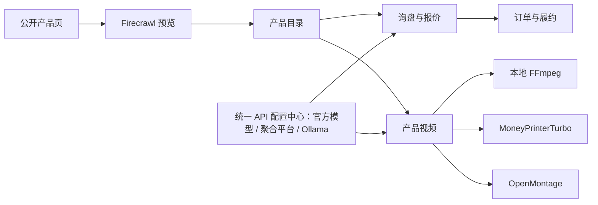

<p align="center">
  
</p>

<h1 align="center">TradePilot</h1>

<p align="center">
  <strong>开源 AI 客服营销、外贸 CRM 与产品视频工作台</strong>
</p>

<p align="center">
  询盘 · 客户 · 报价 · 订单 · AI 获客 · 实时语音客服 · 产品视频
</p>

<p align="center">
  <a href="https://tradepilot.us.kg/"><strong>在线演示</strong></a>
  ·
  <a href="#快速部署"><strong>快速部署</strong></a>
  ·
  <a href="#产品视频工作流"><strong>视频工作流</strong></a>
  ·
  <a href="https://github.com/feifei9126/tradepilot/issues"><strong>反馈问题</strong></a>
</p>

<p align="center">
  
  
  
  
  
</p>

---

## 先看效果

[](https://tradepilot.us.kg/)

> 仓库中的在线演示链接不保证与当前代码同步。新部署使用自己配置的管理员账号，**不要将本地试用密码用于公网环境**。
>
> **部署状态说明：** Docker 是当前完整试用路径；Cloudflare Workers 已具备 OpenNext 构建入口，但 API 配置和视频任务仍依赖本地文件，尚不能作为等价的持久化部署。详见 [Cloudflare 部署与限制](docs/cloudflare-deployment.md)。

TradePilot 面向 1-5 人外贸团队，把分散的客户资料、报价、订单、出货、AI 配置和产品内容生产放进同一个可自托管工作区。它不是只有一张 KPI 看板的演示项目，仓库同时包含业务 API、输入校验、测试、Docker 部署、视频 Worker 和第三方服务接入说明。

## 为什么是 TradePilot

| 你需要解决的问题           | TradePilot 的处理方式                                             |
| -------------------------- | ----------------------------------------------------------------- |
| 客户、询盘、报价和订单分散 | 用一条业务链关联客户、报价、订单、出货和单证草稿                  |
| AI 平台被单一供应商锁定    | 独立 API 配置中心，支持 12 个官方、聚合和本地接入选项      |
| 产品网页和素材整理耗时     | Firecrawl 抓取产品资料、图片和视频，确认后再导入                  |
| 产品视频制作链路割裂       | 本地 FFmpeg、MoneyPrinterTurbo、OpenMontage 三种生产路径统一管理  |
| SaaS 数据与二次开发受限    | AGPL-3.0 开源，支持 Docker 自托管和源码级扩展                     |
| 设置项容易配置失败         | 四步配置引导、平台地址预设、任务模型覆盖与连接测试 |

## 核心能力

### 外贸 CRM 与订单履约

- 客户档案、联系人、标签、来源与跟进状态
- 询盘创建、状态流转和 AI 回复草稿
- 报价草稿、贸易术语、成本加价与人工接受确认
- 报价转订单、订单进度、沟通记录和交期风险
- 出货、物流、供应商、财务汇总与单证草稿
- 基于真实业务记录生成的仪表盘、销售漏斗和待办提醒

### 独立 API 配置中心

登录后从 **系统 → API 配置中心**（`/app/api-config`）进入，不在“设置”页面分散填写。

1. **接入文本模型**：选择平台，填写 API Key、模型 ID 和接口地址。
2. **分配 AI 功能**：询盘、邮件、文字客服、客户资料识别、产品资料补全、报价、跟单、获客文案和视频脚本共用默认 API，也可逐项覆盖模型。
3. **连接语音与视频**：集中管理 LiveKit / OpenAI Realtime、Firecrawl、视频适配器、MoneyPrinterTurbo。
4. **验证并开始使用**：先保存，再测试连接；模型调用可能产生费用。

| 分类 | 接入选项 |
| --- | --- |
| 官方平台 | OpenAI（ChatGPT）、Kimi（Moonshot）、豆包（火山方舟）、Google Gemini、智谱 GLM、DeepSeek、通义千问 |
| 第三方聚合 | OpenRouter、硅基流动（SiliconFlow）、New API / One API 网关 |
| 本地及自定义 | Ollama、其他 OpenAI 兼容 API |

- 预设提供接口地址、模型 ID 填写提示和文档入口。新平台模型以账号控制台实际可用 ID 为准。
- 聚合平台可按业务功能选择不同厂商模型，仍共用聚合平台自身的地址和 Key。
- **Docker / Node 密钥存于服务端 AES-256-GCM 加密文件，不回显给浏览器。** 仅部署管理员可管理；当前是单实例配置，不是多租户密钥保险库。
- 切换平台清空旧密钥、请求头与任务模型，避免将旧凭据发给新服务。旧浏览器配置仅在明确选择后迁移。
- 文本接口采用 OpenAI Chat Completions 协议；不是所有图像、视频或实时语音模型都能通过这一接口调用。

详见 [统一 API 配置指南](docs/api-configuration.md)。

### LiveKit AI 语音客服与营销

登录后进入 **AI 语音客服**（`/app/voice-agent`）：

- 客服答疑 / 营销意向两种场景，中英文实时语音与字幕。
- 收集客户意向后由操作员确认，再创建 CRM 客户。
- 支持人工跟进请求与本地下载对话记录。
- 独立 Python Agent Worker 使用 LiveKit + OpenAI Realtime，在配置中心保存连接信息后加载。

**统一入口不等于一个 Key 访问所有服务。** 其他文本平台的 Key 不会用于 OpenAI Realtime。当前是内部工作台，不包含公开访客入口、自动电话外呼或真实人工坐席转接。获客功能生成营销文案，不自动搜集名单、投放或群发。

详见 [LiveKit Agents 接入说明](docs/livekit-agents.md)。

### Firecrawl 产品采集

- 从公开产品页提取名称、描述、规格、图片和视频
- 导入前预览与人工确认，不直接污染产品数据
- 抓取到的视频可进入 MoneyPrinterTurbo 重新编排
- 本地环境提供 Docker 检测、部署进度、日志和连接验证

### 产品视频工作流

| 模式        | 适合场景           | 运行方式                                       |
| ----------- | ------------------ | ---------------------------------------------- |
| 本地快速    | 内部确认、快速样片 | FFmpeg Worker 生成可播放 MP4                   |
| AI 自动成片 | 社媒推广、客户介绍 | MoneyPrinterTurbo 处理配音、字幕、音乐和多素材 |
| 高级制作    | 品牌项目、复杂镜头 | OpenMontage 命令适配器接入自定义流水线         |

产品视频页包含引擎健康状态、素材输入、任务队列、进度、预览、下载、批量选择和删除。可勾选使用统一 AI 模型生成脚本，再交给渲染服务。Docker 挂载数据卷后，视频任务可持久化；这不代表所有 CRM 业务数据已持久化。

## 快速部署

### Docker 一键部署

前置条件：Docker Desktop，或已启用 Compose 插件的 Docker Engine。

```bash
git clone https://github.com/feifei9126/tradepilot.git
cd tradepilot
bash install.sh
```

安装器会：

1. 生成认证密钥和随机管理员密码。
2. 构建并启动 TradePilot 与本地视频 Worker。
3. 在后台启动 MoneyPrinterTurbo 和 Redis。
4. 在终端输出登录账号、密码和服务状态命令。

完成后访问 [http://localhost:3456](http://localhost:3456)。

常用命令：

```bash
docker compose ps
docker compose logs -f
docker compose restart
docker compose down
```

### 最小 Docker 试用（推荐先从这里开始）

仅启动 Web 和视频适配器，不自动拉取 MoneyPrinterTurbo / Redis，也不调用付费模型：

```bash
cp .env.example .env
# 编辑 .env：设置随机 AUTH_SECRET、强管理员密码、AUTH_URL=http://localhost:3456
# AUTH_SECRET 可用 openssl rand -hex 32 生成。不要覆盖已有部署的密钥。
docker compose up -d --build tradepilot video-worker
```

使用 `.env` 中的管理员账号登录，然后进入 API 配置中心。语音 Worker 按需启动：

```bash
docker compose --profile voice up -d --build livekit-agent
```

**使用期间保持 Docker Desktop 运行。** 默认仅监听本机 `127.0.0.1:3456`，其他电脑不能直接访问。若页面打不开，先检查 Docker，再执行 `docker compose ps`；已创建的试用容器可用 `docker compose start tradepilot video-worker` 恢复。不要执行 `docker compose down -v`，以免删除数据卷。

完整说明：[Docker 本地试用](docs/docker-trial.md)。

### 本地开发

```bash
git clone https://github.com/feifei9126/tradepilot.git
cd tradepilot
npm install
npm run dev
```

开发地址为 [http://localhost:3458](http://localhost:3458)。未配置环境变量时使用演示账号 `demo@tradepilot.dev` / `12345678`。

生产运行：

```bash
npm run build
npm start
```

`npm start` 会同时管理 Next.js 和本地视频 Worker；无需再开第二个终端。只启动网页可设置 `TRADEPILOT_START_VIDEO_WORKER=false`。

### Cloudflare Workers（构建预览，非 Docker 等价部署）

GitHub 用于托管源码；本项目有登录、服务端 API 和独立 Worker，**不能直接部署为 GitHub Pages 静态站点**。

仓库使用 OpenNext + Wrangler 生成 Cloudflare Worker：

```bash
npm ci
npm run cfbuild
npx wrangler deploy --dry-run
```

**构建通过不代表功能可上线。** 当前仍有以下必须处理的限制：

- API 配置中心和视频任务使用本地文件保存；Workers 没有等价的持久磁盘，配置保存会失败，不能用 `/tmp` 代替。
- CRM 主体业务数据在进程内存中；不同 Worker 实例不共享这些数据。
- Python LiveKit Agent、FFmpeg、MoneyPrinterTurbo 和抓取引擎需要独立服务，不会随 Web Worker 一起部署。
- 仅配置 `DATABASE_URL` 不会自动将上述存储迁移到数据库。

在接入持久化存储、配置线上强凭据并完成运行时验收前，不建议覆盖既有线上站点。Cloudflare 登录、Secrets、隔离预览、验收和回滚步骤见 [Cloudflare 部署说明](docs/cloudflare-deployment.md)。

## 工作流



## 配置

复制环境变量模板：

```bash
cp .env.example .env
```

关键配置：

| 变量                        | 用途                                        |
| --------------------------- | ------------------------------------------- |
| `AUTH_SECRET`               | NextAuth 会话签名密钥，生产环境必须随机生成 |
| `TRADEPILOT_ADMIN_EMAIL`    | 部署管理员邮箱                              |
| `TRADEPILOT_ADMIN_PASSWORD` | 部署管理员密码                              |
| `DATABASE_URL`              | 可选，启用 PostgreSQL / Neon 注册账号       |
| `TRADEPILOT_DATA_DIR`       | API 加密配置与产品视频任务目录（Docker / Node）                      |
| `OPENMONTAGE_WORKER_URL`    | OpenMontage / 本地 FFmpeg Worker 地址       |
| `MONEYPRINTERTURBO_URL`     | MoneyPrinterTurbo API 地址                  |
| `FIRECRAWL_API_URL`         | Firecrawl Cloud 或自托管 API 地址           |
| `FIRECRAWL_API_KEY`         | Firecrawl API Key                           |
| `TRADEPILOT_CONFIG_KEY`     | 可选独立配置加密密钥；未设置时使用 `AUTH_SECRET`，至少 32 字符 |
| `LIVEKIT_URL` / `LIVEKIT_API_KEY` / `LIVEKIT_API_SECRET` | LiveKit 连接参数 |
| `OPENAI_API_KEY`            | 可选 OpenAI Realtime 环境回退凭据，不自动作为统一文本 Key |

## 数据与功能边界

开源项目的可信度来自边界清楚，而不是功能列表越长越好：

- 客户、询盘、报价和订单的默认演示数据保存在进程内，服务重启后恢复种子数据。
- PostgreSQL / Neon 当前用于注册账号；业务多租户持久化仍需要继续接入。
- 邮件中心保存草稿和非敏感连接参数，真实 IMAP/SMTP 收发需要独立 Worker。
- 单证为可下载的业务草稿，对外使用前必须核对卖方、包装、支付和合规字段。
- 插件通过源码目录与脚本管理，不在生产环境执行未经审查的第三方运行时代码。
- AI 输出、抓取内容和视频脚本都应由业务人员确认后使用。
- 密钥、数据库 URL、真实客户资料、加密配置文件和数据卷都不能提交到 GitHub；更换加密密钥前须备份原密钥与配置文件。
- 真实模型、实时语音、抓取与完整视频渲染需要对应账号权限和独立服务；本地 mock 测试不等于真实厂商联调。
- 公网部署前须处理依赖安全告警、使用 HTTPS 和强凭据，不能照搬公开试用账号。

## 技术栈

| 层级      | 技术                                           |
| --------- | ---------------------------------------------- |
| Web       | Next.js 16、React 19、TypeScript、Tailwind CSS |
| UI        | Base UI、Lucide、Motion                        |
| Auth / DB | NextAuth、Drizzle ORM、Neon PostgreSQL         |
| AI        | 统一配置、OpenAI 兼容请求层、Ollama                      |
| 语音      | LiveKit Agents、OpenAI Realtime、Python / uv |
| 采集      | Firecrawl                                      |
| 视频      | FFmpeg、MoneyPrinterTurbo、OpenMontage Adapter |
| 部署      | Docker Compose、OpenNext、Cloudflare Workers   |
| 测试      | Node Test Runner、TSX                          |

## 项目结构

```text
tradepilot/
├── src/app/                 # 页面与 API 路由
├── src/components/          # 业务组件与 UI 基础组件
├── src/lib/                 # AI、业务、采集、视频与安全逻辑
├── tests/                   # 业务、配置安全、LiveKit、视频与构建测试
├── agents/customer-service/ # 独立 Python LiveKit Agent Worker
├── workers/openmontage-adapter/
├── docs/                    # 集成与部署说明
├── docker-compose.yml
├── install.sh
└── wrangler.jsonc
```

深入文档：

- [统一 API 配置与 12 个提供商接入](docs/api-configuration.md)
- [Docker 本地试用与恢复](docs/docker-trial.md)
- [LiveKit AI 语音客服](docs/livekit-agents.md)
- [Cloudflare 部署限制与验收](docs/cloudflare-deployment.md)

- [Firecrawl 产品媒体采集](docs/firecrawl-product-media.md)
- [MoneyPrinterTurbo 产品视频](docs/moneyprinterturbo-product-video.md)
- [OpenMontage 产品视频](docs/openmontage-product-video.md)
- [架构说明](ARCHITECTURE.md)
- [贡献指南](CONTRIBUTING.md)
- [安全策略](SECURITY.md)

## 验证

```bash
npm test
npx tsc --noEmit
npm run lint
npm run build
# 如使用 LiveKit Worker（需安装 uv）
uv run --directory agents/customer-service pytest -q
uv run --directory agents/customer-service ruff check .
# Cloudflare 构建检查，不会上传
npm run cfbuild
npx wrangler deploy --dry-run
```

当前测试覆盖报价转订单、出货联动、输入完整性、Webhook 鉴权、12 个提供商与任务路由、API 配置加密/版本冲突/密钥隔离、LiveKit 会话授权、Firecrawl SSRF 防护、视频任务持久化和 Worker 资产地址约束。全量 lint 与依赖审计应独立检查，不以构建成功代替安全验收。

## 适用场景

TradePilot 适合寻找以下方案的开发者和小型团队：开源外贸 CRM、外贸订单管理系统、跨境贸易管理、自托管 CRM、私有化 AI 跟单、Ollama 外贸应用、Firecrawl 商品采集，以及产品视频自动生成工作流。

## 参与项目

- 使用问题与功能建议：[GitHub Issues](https://github.com/feifei9126/tradepilot/issues)
- 提交代码前阅读：[CONTRIBUTING.md](CONTRIBUTING.md)
- 安全问题请按：[SECURITY.md](SECURITY.md)

如果这个项目解决了你的实际问题，可以在 GitHub 点 Star，帮助更多需要开源外贸管理工具的团队发现它。

## License

TradePilot 使用 [GNU AGPL-3.0](LICENSE) 许可证。通过网络提供修改后的版本时，请遵守 AGPL-3.0 的源代码开放要求。
